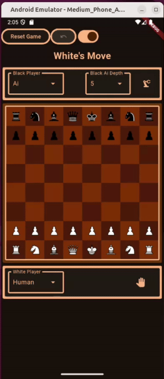
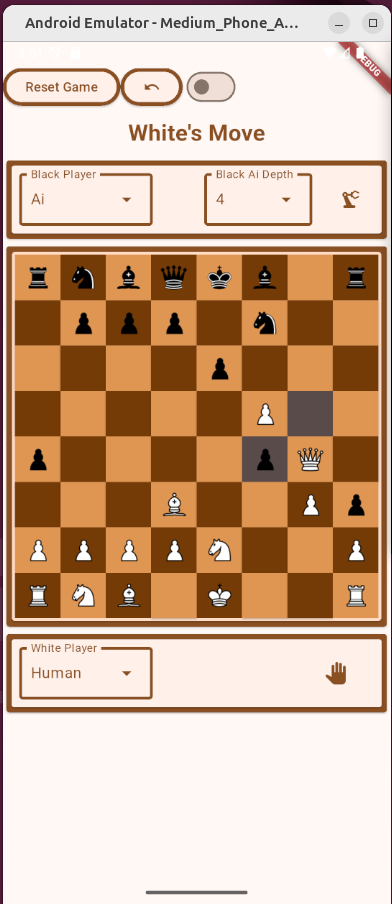
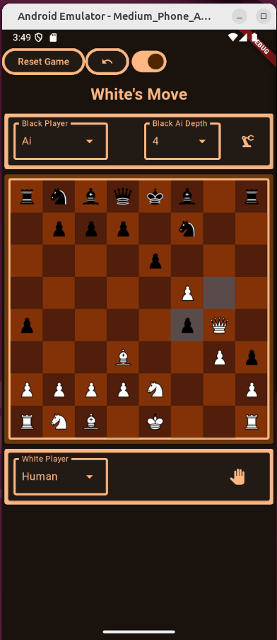
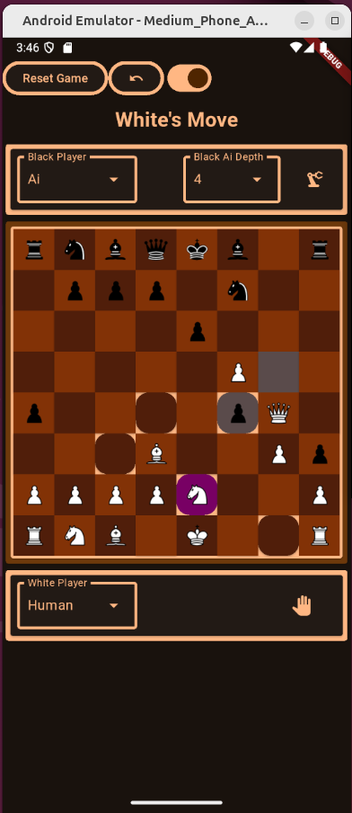

# Mobile Chess App

go_chess is a mobile app I created to familiarize myself with Golang, Flutter, and Test Driven Development. So far I have gotten the AI working and playing well, and made a simple and beautiful user interface. 

Many of the files in this repository were autogenerated by Flutter. To see the code I wrote in Golang which includes the move logic and AI, go to [chess_ffigen/src/](https://github.com/tawatts1/go_chess/tree/main/chess_ffigen/src). To see the code I wrote for the UI, go to 
[play/lib/](https://github.com/tawatts1/go_chess/tree/main/play/lib). 
## Roadmap

- [x] Make a simple Chess board with pieces in Flutter
- [x] Make a simple golang function to return example moves
- [x] Make the Flutter app use the golang function using flutter_ffi. 
- [x] Build out golang functions for legal moves for all pieces, and include tests for each one. Account for *en passant*, castling, and legal moves when the king is in check. 
- [x] Build a simple AI in Go that looks 1 move ahead. 
- [x] Update Flutter app to be able to play against the AI. 
- [x] Improve the AI to look multiple moves ahead, and improve efficiency against benchmarks until it is fast enough to play comfortably. 
- [x] Update UI to be more beautiful
- [x] Add in an undo button and remember app state in case app is closed in the middle of a game
- [ ] Create multiple AI's that employ different strategies and allow the user to choose between them. 
- [ ] Keep track of wins, losses and stalemates for different difficulty levels. 
- [ ] Put the app on the Google Play store.
- [ ] Create a Chess variant.

<table>
    <tr>
        <th>
        Light Mode
        </th>
        <th>
        Dark Mode
        </th>
        <th>
        Knight selected in Dark Mode
        </th>
    </td>
    <tr>
        <td>
            
        </td>
        <td>
            
        </td>
        <td>
            
        </td>
    </tr>
</table>
